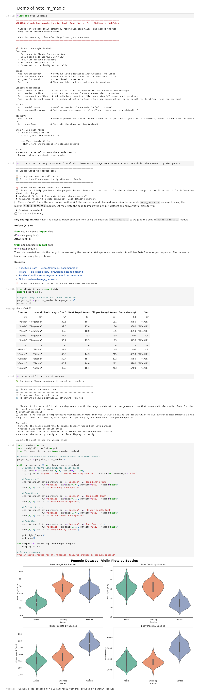

# notellm

**Lightweight Jupyter magic extension for Claude Code integration.**

[Claude Code](https://docs.anthropic.com/en/docs/claude-code) is my favorite LLM tool, and I wanted to use it directly within Jupyter notebooks. notellm provides the `%cc` magic command that lets Claude work *inside* your notebook—executing code, accessing your variables, searching the web, and creating new cells:

```python
%cc Load the penguins dataset searching for the most recent Altair 6.0 syntax, convert to Polars
```

Claude searches for the current API, writes the code, and creates a new cell with the result—all within my notebook session. The `%cc` cells act as scaffolding that I typically remove once the code is working.

This differs from sidebar-based approaches where you chat with an LLM separately and copy/paste results. With notellm, code development happens iteratively from within notebook cells.

I work in bioinformatics and developed notellm for myself, but hopefully it's useful for other bioinformaticians, data scientists, or anyone wanting to use Claude Code within Jupyter.

notellm is adapted from a development version released by Anthropic. Any issues are my own.

**Key features:**
- Full agentic Claude Code execution within notebook cells
- Claude has access to your notebook's variables and state
- Web search and file operations without leaving the notebook
- Conversation continuity across cells
- Automatic permissions setup for common operations

**See also:** [Vizard](https://github.com/prairie-guy/vizard) — a stateful declarative language for LLM-driven Python visualization code combining structured keywords with natural language. It includes a large `CLAUDE.md` file optimized for use with Polars and Altair. Example:

```python
%%cc
DATA penguins.csv FILTER species == "Adelie" || PLOT violin Y body_mass_g COLOR sex
```

## Example Session



## Installation

### Prerequisites

1. Install [Claude Code](https://docs.anthropic.com/en/docs/claude-code):
```bash
npm install -g @anthropic-ai/claude-code
```

2. Install Python dependencies (pip only):
```bash
pip install trio claude-agent-sdk
```
(tested with trio==0.24.0, claude-agent-sdk==0.1.18)

**Note:** Use pip for these dependencies. The `claude-agent-sdk` package is only available on PyPI, not conda-forge.

### Install notellm_magic

```bash
./setup.sh
```

This copies `notellm_magic/` to your user site-packages.

### Uninstall

```bash
./uninstall.sh
```

## Usage

In a Jupyter notebook:

```python
%load_ext notellm_magic
```

On load, you'll see a security warning and the Claude Code Magic banner:

```
================================================================================
WARNING: Claude has permissions for Bash, Read, Write, Edit, WebSearch, WebFetch

  Claude can execute shell commands, read/write/edit files, and access the web.
  Only use in trusted environments.

  Consider removing .claude/settings.local.json when done.
================================================================================

Claude Code Magic loaded!
```

On first load in a directory, notellm also creates `.claude/settings.local.json` with default permissions.

### Permissions

The auto-created `.claude/settings.local.json` grants Claude access to:
- **Bash** - Run shell commands
- **Glob** - Find files by pattern
- **Grep** - Search file contents
- **Read** - Read files
- **Edit** - Modify files
- **Write** - Create files
- **WebSearch** - Search the web
- **WebFetch** - Fetch web content

To customize, edit `.claude/settings.local.json` in your project directory.

### Basic Usage

```python
%cc Create a hello world script
```

Or multi-line:

```python
%%cc
Create a function that calculates fibonacci numbers
Use memoization for efficiency
```

### Magic Commands

**Basic:**
- `%cc <instructions>` - Continue conversation (one-line)
- `%%cc <instructions>` - Continue conversation (multi-line)
- `%cc_new` (or `%ccn`) - Start fresh conversation
- `%cc --help` - Show all options

**Context management:**
- `%cc --import <file>` - Add file to conversation context
- `%cc --add-dir <dir>` - Add directory to Claude's accessible directories
- `%cc --mcp-config <file>` - Set path to MCP server config
- `%cc --cells-to-load <num>` - Number of cells to load into new conversation

**Output:**
- `%cc --model <name>` - Model to use (default: sonnet)
- `%cc --max-cells <num>` - Max cells Claude can create per turn (default: 3)

**Display:**
- `%cc --clean` - Replace prompt cells with Claude's code cells
- `%cc --no-clean` - Keep prompt cells (default)

### When to use each form

- **`%cc`** (single %) - Short, one-line instructions
- **`%%cc`** (double %) - Multi-line instructions or detailed prompts

### Notes

- Restart the kernel to stop the Claude session

## Project Structure

```
notellm/
├── archive/
│   └── cc_jupyter/           # Pristine copy from PyPI
├── notellm_magic/
│   ├── __init__.py           # Thin wrapper + permissions setup
│   └── cc_jupyter/           # Patched fork
├── build/
│   └── build_notellm_magic.sh
├── docs/
│   └── demo.ipynb            # Demo notebook
├── setup.sh
├── uninstall.sh
├── LICENSE
└── README.md
```

## Development

### Rebuilding from archive

If you update `archive/cc_jupyter/` with a new upstream version:

```bash
./build/build_notellm_magic.sh
```

This copies the archive to `notellm_magic/cc_jupyter/` and applies patches.

### Patches Applied

1. **Permission error fix** (`magics.py`) - Wraps `/root/code` check in try/except
2. **Decorative header removal** (`jupyter_integration.py`) - Removes banner comments from generated cells

## Attribution

This project is a fork of `claude-code-jupyter-staging` by Anthropic, released under the MIT License.

See [LICENSE](LICENSE) for details.
